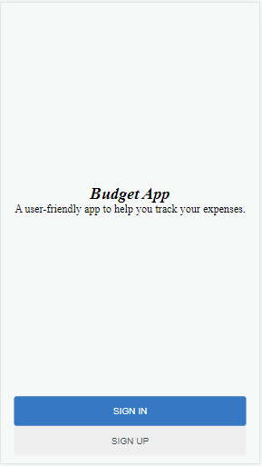

<!-- TABLE OF CONTENTS -->

# 📗 Table of Contents

- [📖 About the Project](#about-project)
  - [🛠 Built With](#built-with)
    - [Tech Stack](#tech-stack)
    - [Key Features](#key-features)
- [💻 Getting Started](#getting-started)
  - [Setup](#setup)
  - [Prerequisites](#prerequisites)
  - [Install](#install)
  - [Usage](#usage)
- [👥 Authors](#authors)
- [🔭 Future Features](#future-features)
- [🤝 Contributing](#contributing)
- [⭐️ Show your support](#support)
- [🙏 Acknowledgements](#acknowledgements)
- [📝 License](#license)

<!-- PROJECT DESCRIPTION -->

# 📖 [BUDGET APP] <a name="about-project"></a>

**[Budget app]** is an application designed for users to track their expenditures.

## 🛠 Built With <a name="built-with"></a>

### Tech Stack <a name="tech-stack"></a>

- <a href="https://www.ruby-lang.org/es/">ROR</a>
- <a href="https://www.postgresql.org/">Postgresql</a>
- <a href="https://rspec.info/">Rspec</a>

<!-- Features -->

### Key Features <a name="key-features"></a>

- **[Users can view their transaction and Categories]**
- **[Users can create a transaction]**
- **[Users can create a category.]**
- **[Limit access to web app resources based on authorization rules.]**

- Here is a [Live Demo Link](https://budget-application-5ef7.onrender.com/splash)
- Here is a [presentation video link](https://www.loom.com/share/eabe14e08e1d4f2b99f2f9c39988d6df)

## Project Screenshots



<p align="right">(<a href="#readme-top">back to top</a>)</p>

<!-- GETTING STARTED -->

## 💻 Getting Started <a name="getting-started"></a>

To get a local copy up and running, follow these steps.

### Prerequisites

In order to run this project you need the following installed in your local system

<ul>
<li>Ruby</li>
<li>Git CLI</li>
<li>Github account</li>
</ul>

### Setup

Clone this repository to your desired folder:

```sh
  cd my-folder
  git clone https://github.com/donmark2k/budget_app.git
```

### Install

Install this project with:

```sh
  cd budget_app
  bundle install
```

### Usage

To run the project, execute the following command:

```sh
  rails server
```
### Run tests

-  Type `Rspec`: To run test `
-  Type `npx stylelint "**/*.{css,scss}"` to run for stylelint errors


<p align="right">(<a href="#readme-top">back to top</a>)</p>

<!-- AUTHORS -->

## 👥 Authors <a name="authors"></a>

👤**Chukwuemeka Ochuba**

- GitHub: [@Donmark2k](https://github.com/Donmark2k)
- Twitter: [@Donmark2k](https://twitter.com/donmark2k)
- LinkedIn: [LinkedIn](https://www.linkedin.com/in/chukwuemeka-ochuba/)


<p align="right">(<a href="#readme-top">back to top</a>)</p>

<!-- FUTURE FEATURES -->

## 🔭 Future Features <a name="future-features"></a>


- [ ] **[Add the Calculator]**
- [ ] **[Style the front end]**


<p align="right">(<a href="#readme-top">back to top</a>)</p>

<!-- CONTRIBUTING -->

## 🤝 Contributing <a name="contributing"></a>

Contributions, issues, and feature requests are welcome!

Feel free to check the [issues page](https://github.com/donmark2k/budget_app/issues).

<p align="right">(<a href="#readme-top">back to top</a>)</p>

<!-- SUPPORT -->

## ⭐️ Show your support <a name="support"></a>

If you like this project please leave a STAR to the [Github repo](https://github.com/donmark2k/
budget_app/)

<p align="right">(<a href="#readme-top">back to top</a>)</p>

<!-- ACKNOWLEDGEMENTS -->

## 🙏 Acknowledgments <a name="acknowledgements"></a>

I would like to appreciate [Microverse](https://www.microverse.org/) for providing the learning resources for this exercise, and I would specially thank   [Gregoire Vella](https://www.behance.net/gregoirevella) who is the original author of this [design](https://www.behance.net/gallery/19759151/Snapscan-iOs-design-and-branding?tracking_source=)

<p align="right">(<a href="#readme-top">back to top</a>)</p>

<!-- LICENSE -->

## 📝 License <a name="license"></a>

This project is [MIT](./LICENSE) licensed.


<p align="right">(<a href="#readme-top">back to top</a>)</p>